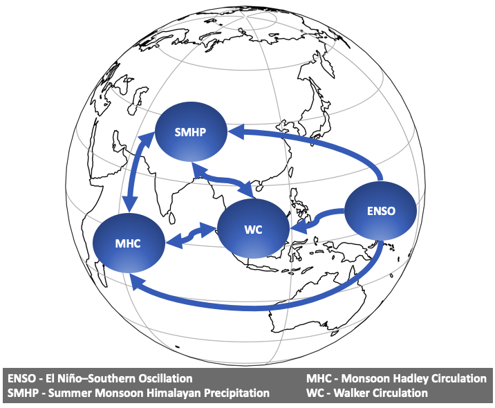

# Causal discovery of drivers of the summer Himalayan precipitation

{: style="text-align:center"}

    

    

This code uses a causal discovery and causal inference methods to analyse linkages among ENSO, circulation fields, and the summer monsoon precipitation over the Himalayas.

{: style="text-align:center"}

Requirements
------------
**Main requirements**
* Python >= 3.9
* Tigramite >= 5.0

The rest of requirements can be installed by using 'requirements_file.txt' by creating a virtual environment as follows:

    $ conda create --name <env> --file <this file>

The code has been tested on platform: osx-64.

Instructions
------------
To run the code you can use a jupyter notebook: 'Causal analysis of climate dynamics.ipynb'. 
The notebook uses 'config.yml' with the basic setup for:
* preprocessing of climate indices 
* plotting maps
* statistical testing
* lagged cross-correlation
* causal discovery using PCMCI algorithm and causal inference implemented in [Tigramite](https://github.com/jakobrunge/tigramite)
* plotting causal graphs
* bootstrapping